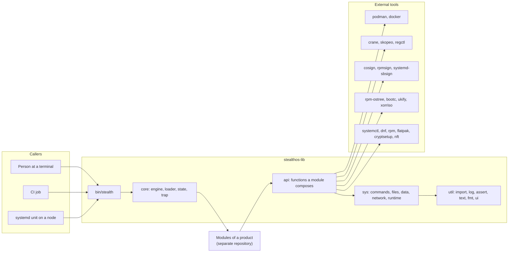
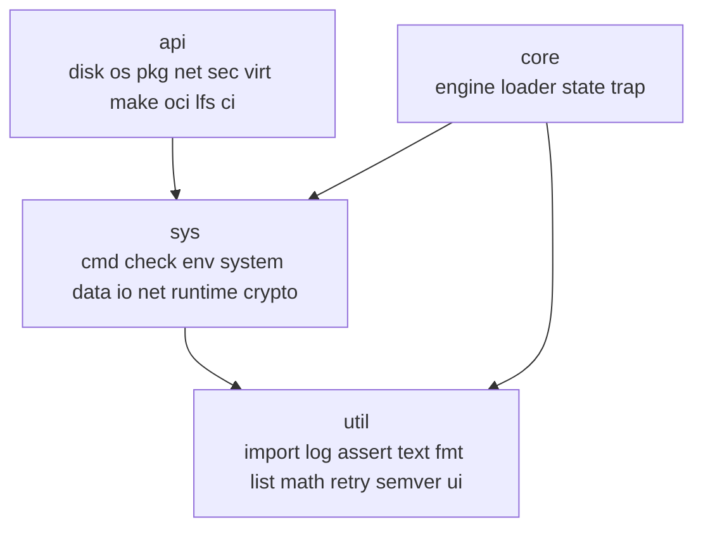
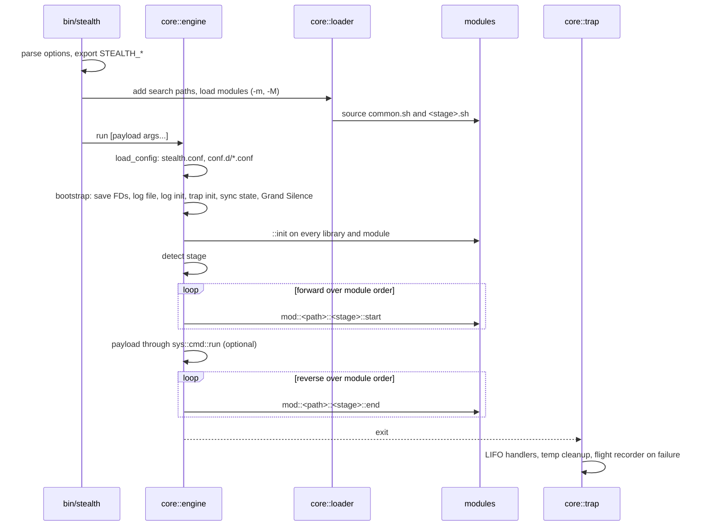

# stealthos-lib architecture

**Date:** 2026-09-20
**Scope:** the library and its command. The modules that build and configure a product are clients of this library and live in their own repository. This document describes what the library is made of, how its parts depend on each other, what contracts they expose, and where it runs.

## 1. Purpose

`stealthos-lib` is a Bash library with one command, `stealth`. The command loads modules, runs them through a lifecycle, and gives them namespaced functions for everything a module has to do: log, assert, run commands, edit files, build packages in containers, assemble OCI images, sign artifacts, and configure a running node.

The library builds nothing on its own. A module of a product calls it. The same library serves four places.

| Where it runs | Stage | What the modules do there |
| --- | --- | --- |
| A developer machine or a build node | `build` | Build toolchain, package, kernel, UKI, bootc and media images |
| A CI runner | `build` | The same, unattended, with an OIDC identity and a registry cache |
| A host before a build | `setup` | Prepare the store, the vault and the tools |
| A deployed node | `root`, `user` | Configure disks, users, services, network, policy and containers |

Everything the library does is a function. Nothing is a subcommand of its own. The command is the entry point and the module list is the program.

## 2. Context



The library drives external tools. It is not a package manager, a registry, a signer or a CI system.

## 3. Layers and the dependency rule

The library has four layers. Dependencies point downward. The importer detects a cycle and aborts.



| Layer | May import | Rule |
| --- | --- | --- |
| `util` | Nothing outside `util` | Pure bash. `list` uses `sort`, `ui` uses `tput`, `retry` uses `sleep`. No other external command. `math` counts and formats without either `awk` or `numfmt` |
| `sys` | `util`, other `sys` modules | `sys/cmd` imports `util` only, so `sys/io` can import it without a cycle |
| `core` | `util`, `sys/cmd`, `sys/check`, `sys/io/fs`, `sys/io/tmp` | The engine never imports `api` |
| `api` | `util`, `sys`, other `api` modules | A module of a product imports `api` and below |

### 3.1 Files and names

- One module per file, `src/lib/<layer>/<path>.sh`. Files are sourced and carry no shebang.
- The namespace is the path: `src/lib/sys/io/fs.sh` defines `stealth::sys::io::fs::<name>`. A private function has a leading underscore on its last component: `stealth::sys::cmd::_exec_buffered`.
- The guard variable is `_STEALTH_LIB_<PATH>` with the path upper-cased and `/` and `-` replaced by `_`: `sys/io/fs` guards with `_STEALTH_LIB_SYS_IO_FS`. The first two lines of every module test and declare it.
- Every function has a docblock with a summary, `Arguments`, `Returns`, and `Globals` or `Outputs` where they apply. Arguments state their type and their default.
- Output returns through a nameref in the first argument. Every local in a function that takes a nameref has a prefix unique to the function, so a callee's local never shadows the caller's variable.

### 3.2 The inventory

| Group | Modules | Role |
| --- | --- | --- |
| `util` | `import`, `log`, `assert`, `text`, `fmt`, `list`, `math`, `retry`, `semver`, `ui` | The importer, logging, assertions, string and list helpers, text layout, retries, versions, terminal output |
| `core` | `engine`, `loader`, `state`, `trap` | The lifecycle, module loading, the state registry, signals and cleanup |
| `sys` | `cmd`, `check`, `env`, `system`, `crypto` | Command execution, host checks, environment, system facts, hashing and encryption primitives |
| `sys/data` | `ini`, `json`, `kv`, `toml`, `yaml` | Read and write configuration formats |
| `sys/io` | `fs`, `tmp`, `conf`, `content`, `archive`, `block` | Atomic file edits, temp files, config routing by extension, templates, archives, block devices |
| `sys/net` | `conn`, `fetch`, `git`, `github`, `gitlab`, `iface` | Connectivity checks, downloads with checksums, git, forge APIs, interfaces |
| `sys/runtime` | `arch`, `hash`, `host`, `lock`, `proc`, `user` | Target triples, digests, host facts, `flock`, processes, users |
| `api/disk` | `part`, `fmt`, `luks` | Partitions, filesystems, LUKS2 with TPM2 and FIDO2 enrolment |
| `api/os` | `user`, `service`, `locale`, `time`, `kernel`, `kmod`, `boot`, `bootc` | Users, systemd units, locale, chrony, kernel builds, modules, boot media, bootc images and nodes |
| `api/pkg` | `manager`, `dnf`, `rpm`, `ostree`, `flatpak`, `appimage` | Package managers inside build containers and on nodes |
| `api/net` | `conn`, `dns`, `fw` | NetworkManager, resolved with DoT, firewalld and nftables on nodes |
| `api/sec` | `auth`, `policy`, `audit`, `secret`, `crypto`, `sign`, `receipt`, `consensus` | PAM, polkit, auditd, secrets, verification, signing backends, provenance, receipt comparison |
| `api/virt` | `container`, `qemu` | Podman and docker with the sandbox flag set, QEMU with OVMF and swtpm |
| `api/make` | `core`, `pkg`, `cc`, `go`, `rust`, `zig`, `rpm`, `oci`, `plan` | Build steps, the package build driver, build systems, rpmbuild, composition, the planner of section 14 |
| `api/oci` | `layer`, `image`, `store`, `artifact`, `verify` | Layer tars, images from layers, the OCI layout store, referrers, inspection |
| `api/lfs` | `env`, `host`, `sources`, `pkg`, `toolchain` | The bootstrap driver for the seed and the cross toolchain |
| `api/ci` | `ci` | CI detection, OIDC identity, registry cache, job summary |

`util/fmt`, `api/oci`, `api/sec/{sign,receipt,consensus}`, `api/ci` and `api/make/plan` are new. `util/fmt` holds the padding, cutting and wrapping that the old `util/ui` did inline, so the UI composes them and a test reads a laid-out line without a terminal. `api/virt/container` and `api/make/{core,pkg,oci}` are rewritten. `core/state`, `api/oci/store`, `api/make/pkg`, `api/sec/receipt` and `util/ui` gain the functions of section 14. The rest is ported with the defects listed in `library-analysis.md` fixed.

## 4. The importer

`util/import` is the linker of the library (`.scratch/src/lib/util/import.sh`, read in full).

- `stealth::util::import PATH...` validates each name against `^[a-zA-Z0-9/_/-]+$`, so a name cannot contain a dot and cannot leave the library directory.
- It resolves a name under the library root first, then under the search paths added with `stealth::util::import::add_path`, which accepts absolute paths only.
- It keeps a loaded registry and a loading registry. A name that is loading is a cycle, and a cycle aborts. A name whose guard variable is already set is marked loaded without sourcing, so a concatenated bundle of modules loads.
- A missing module aborts with `Library not found`.
- Before `util/log` is loaded, the importer prints errors and warnings itself with a `[BOOTSTRAP]` prefix.

The engine's module search paths and the importer's search paths are the same list. `core::state::add_search_path` appends to both.

## 5. The engine

The engine is `core/{engine,loader,state,trap}` (`.scratch/src/lib/core/*.sh`, read in full). It is kept as it is, with the fixes in section 12.

### 5.1 A run



### 5.2 Stages

| Stage | Selected by | Meaning |
| --- | --- | --- |
| `build` | `-s build` | Build images on a build machine, in a build container or on a CI runner |
| `setup` | `-s setup` | Prepare a host: the store, the vault, the tools |
| `root` | EUID 0 without `-s` | Configure a deployed node as root |
| `user` | EUID not 0 without `-s` | Configure a session on a deployed node |

`state::detect_stage` reads `STEALTH_STAGE` first and caches the result. The engine accepts the four names in `_exec_hook` (`engine.sh` line 67).

### 5.3 The module contract

A module is a directory on a search path with two optional files.

| File | Sourced when | Defines |
| --- | --- | --- |
| `common.sh` | Always | `mod::<path>::init` and shared functions |
| `<stage>.sh` | The detected stage matches | `mod::<path>::<stage>::start` and `mod::<path>::<stage>::end` |

The namespace of a module is its path under the prefix `mod`, with `/` as `::` and `-` as `_`. Every hook is optional. `init` runs at bootstrap. `start` runs forward over the load order. `end` runs in reverse. A hook takes no arguments and reads its settings from the state registry. A module that takes part in a build graph declares its dependencies in `init` with `stealth::core::state::depends`, as section 14 describes.

```bash
# modules/pkg/zlib/common.sh
mod::pkg::zlib::init() {
    stealth::util::import "api/make/pkg"
}
```

```bash
# modules/pkg/zlib/build.sh
mod::pkg::zlib::build::start() {
    stealth::api::make::pkg::build "pkg/zlib" \
        --version 1.3.1 \
        --from toolchain/musl-gcc \
        --dep pkg/musl \
        --source zlib-1.3.1.tar.xz \
        --system autotools \
        --configure './configure --prefix=/usr --static'
}
```

Modules are ordered by the list. The list is a file that defines `MODULES=()`, given with `-M`, or repeated `-m` options. `loader::load_manifest` sources the list, so the list is trusted code, not configuration.

### 5.4 Configuration and state

`core/state` is the registry every function reads from (`state.sh` lines 116 to 144).

- `state::get OUT KEY` reads the registry, then `STEALTH_<KEY>` upper-cased from the environment, then `KEY` itself.
- `engine::load_config` reads `/etc/stealth/stealth.conf` and `/etc/stealth/conf.d/*.conf` as `KEY=VALUE` lines. Comments and blank lines are skipped, a leading `export` and surrounding quotes are stripped, and a key that was already in the environment when the engine was imported is not overwritten. The files are read, not sourced.
- The binary exports `STEALTH_LOG_LEVEL`, `STEALTH_LOG_FILE`, `STEALTH_STAGE`, `STEALTH_DRY_RUN`, `STEALTH_CONF_FILE` and `STEALTH_CONF_DIR` from its options before the engine is imported.

| Key | Read by | Meaning | Default |
| --- | --- | --- | --- |
| `stage` | The engine | The lifecycle stage | By EUID |
| `dry_run` | `sys/cmd` | Log commands instead of running them | `0` |
| `log_level`, `log_file`, `log_format`, `log_color` | `util/log` | Level 0 to 5 or a name, a file or `auto`, `text`, `json`, `logfmt`, `auto`, `always`, `never` | `3`, none, `text`, `auto` |
| `engine` | `api/virt/container` | `podman` or `docker`, else the first found | Detected |
| `store` | `api/oci/store` | The OCI layout directory of the run | `/build/store` |
| `vault` | `api/lfs/sources`, `api/make/pkg` | The read-only directory of sources | `/vault` |
| `lock` | `api/make/pkg` | The lock file with sources, digests, gate signatures and the epoch | `$vault/sources.lock.json` |
| `epoch` | `api/oci`, `api/make` | `SOURCE_DATE_EPOCH` for every container and tar | From the lock |
| `jobs` | `api/make` | The jobs count inside a build | `nproc` |
| `cache` | `api/oci/store` | Reuse an image whose key exists | `1` |
| `signer` | `api/sec/sign` | `dev`, `sigstore-key`, `sigstore`, `sequoia`, `gpg`, `kms:URI` or `request` | `request` |
| `profile` | `api/make/oci` | The flavor profile a composition reads | None |
| `ci` | `api/ci` | Force CI mode on or off | Detected |
| `concurrency` | `api/make/plan` | The number of jobs the scheduler runs at once | `nproc` |
| `runner` | `api/make/plan` | The `runs-on` label of a generated CI job | `self-hosted` |
| `plan` | `api/make/plan`, `api/sec/receipt` | The path of `plan.json` for the run | `$store/plan.json` |

### 5.5 Input and output

Bootstrap saves stdout and stderr, then redirects them (`engine.sh` lines 239 to 326).

- The logger writes to the saved stderr. The console stays readable.
- stdout goes to the log file when one is configured, else to `/dev/null`. This is the Grand Silence: a command that prints does not reach the terminal.
- stderr goes to a flight recorder file. `core::trap` prints it once, at exit, only when the exit status is not zero.
- `sys::cmd::stream` writes to the saved stderr for the commands whose output a person wants to watch.

### 5.6 Signals and cleanup

`core/trap` installs `ERR`, `EXIT`, `INT` and `TERM` handlers at bootstrap (`trap.sh` lines 240 to 254).

- `ERR` logs the failing command, its source and line, prints a stack trace, and exits with the command's status.
- `EXIT` disables the traps, restores the FDs, runs the deferred handlers in LIFO order, dumps the flight recorder on failure, and removes it on success.
- `INT` and `TERM` exit with 130.
- `stealth::core::trap::defer NAME [ARGS...]` pushes a handler. `sys::io::tmp::cleanup` is pushed at init, so every registered temp file is removed at exit.

## 6. The sys layer

### 6.1 Commands

`sys/cmd` runs every external command of the library (`.scratch/src/lib/sys/cmd.sh`, read in full). It imports `util` only.

| Function | Output | On failure | Use it for |
| --- | --- | --- | --- |
| `run CMD...` | Buffered to a temp file, shown on failure | Logs the output and aborts with the command's status | A step that must succeed |
| `try CMD...` | Buffered | Logs at debug and returns the status | A check |
| `capture OUT CMD...` | stdout into the nameref, stderr buffered | Logs stderr and returns the status | A value |
| `stream CMD...` | To the console FD | Returns the status | Long builds a person watches |
| `silent CMD...` | Discarded | Returns the status | A predicate |
| `exists NAME` | None | Returns 1 | A cached `type -t` check |
| `timeout DURATION CMD...` | As `try` | Returns 124 on expiry | A bounded wait |

Every executor honours `dry_run`: it logs the command and returns 0. The temp buffer is made without a fork, under `/run/user/$EUID` when it exists, else `TMPDIR`. A status above 128 is reported with its signal name.

### 6.2 Files

- `sys::io::fs::atomic TARGET CALLBACK [--mode M] [--owner O]` creates a temp file beside the target with `sys::io::tmp::create_in`, calls the callback on it, applies mode and owner, compares it with the target, and renames it over the target with `mv -Z` only when it differs. Every write of a configuration file on a node goes through it.
- `sys::io::fs::line`, `touch`, `mkdirs` and the rest take the path first. Mode and owner follow as `--mode` and `--owner`.
- `sys/io/tmp` wraps `mktemp` and keeps a registry. `create`, `create_with_suffix`, `create_dir`, `create_in` and `create_dir_in` register their result. `remove` refuses an unsafe path. `cleanup` runs from the exit trap.
- `sys/io/conf` routes by extension: `.json` to jq, `.yaml` to yq, `.toml` and `.ini` to the readers in `sys/data`, anything else to `KEY=VALUE`. The `toml` and `ini` readers are pure bash for the subset a node's configuration uses, so a node needs no Python.
- `sys/io/archive` unpacks and packs tar, zip and cpio. `sys::api::oci::layer` builds on it for deterministic tars.
- `sys/io/block` wraps `lsblk`, `blkid` and `mount` for the disk group.

### 6.3 Hashes, JSON and locks

- `sys::runtime::hash::file OUT PATH`, `::string OUT STRING`, `::tree OUT DIR`. The string form hashes the bytes without a trailing newline. The tree form walks in `LC_ALL=C` sorted order and hashes paths, modes and contents, so a tree digest is the same on every host.
- `sys::data::json::get`, `::set`, `::canonical`. Every JSON document the library writes goes through `canonical`, which is `jq --sort-keys --compact-output`.
- `sys::runtime::lock::acquire PATH` wraps `flock`, for one run per store.

### 6.4 Environment

`sys::env::scrub OUT_ARRAY` builds the environment a container step receives: `PATH`, `HOME=/build/home`, `TMPDIR=/build/tmp`, `LC_ALL=C`, `TZ=UTC`, `SOURCE_DATE_EPOCH`, `JOBS` and the `STEALTH_*` keys of section 5.4. Nothing else from the caller's environment enters a container.

### 6.5 Network and runtime

`sys/net` fetches with a checksum, clones git, talks to GitHub and GitLab, and reads interfaces. `sys/runtime` gives the target triple table, host facts, `flock`, processes and users. `sys/net` is present in the `stealth` package and absent from the `stealth-build` package, as section 10 describes.

## 7. The api layer

### 7.1 Containers

`api/virt/container` detects the engine, `podman` before `docker`, unless `engine` is set. Every function applies the sandbox flag set, and a module never writes an engine flag.

| Concern | Flags |
| --- | --- |
| No network | `--network none` |
| No capabilities | `--cap-drop ALL` |
| No SELinux relabel of the mounts | `--security-opt label=disable` |
| Read-only root, writable work directory | `--read-only --tmpfs /build:rw,exec` |
| Read-only inputs | `--volume $vault:/vault:ro --volume $lib:/stealth:ro` |
| Identity | `--user UID:GID`, and `--userns=keep-id` on podman |
| Limits | `--pids-limit`, `--memory`, `--cpus` from the state keys when set |
| No pulls, no leftovers | `--pull never --rm` |

Functions: `run IMAGE [--mount SRC:DST[:ro]]... [--env K=V]... [--workdir DIR] -- CMD...`, `exec`, `stop`, `rm`, `pull`, `rmi`, `is_running`, `inspect`, `wait`, `logs`, `cp`, and `systemd NAME IMAGE ARGS...` which writes a unit for a node.

### 7.2 Layers, images and the store

`api/oci` never calls `podman build`. A layer is a tar that the library writes, and an image is layers plus a config and a manifest.

- `layer::pack DIR OUT` writes the tar with `--sort=name --mtime=@$epoch --owner=0 --group=0 --numeric-owner --pax-option=exthdr.name=%d/PaxHeaders/%f,delete=atime,delete=ctime`. `layer::digest OUT TAR` is its diff ID. `layer::unpack TAR DIR` extracts it.
- `image::from_layer NAME LAYER OUT [--base REF] [--label K=V]... [--annotation K=V]...` runs `crane append --oci-empty-base -f LAYER -t NAME -o OUT`, then `crane mutate` for labels and annotations. Two runs on one layer give one digest, tested on 2026-09-19. `image::export REF OUT` extracts a filesystem tar. `image::flatten` squashes.
- `store::init DIR` creates the OCI layout. `store::key OUT INPUT...` hashes the inputs of a build into the key. `store::has NAME`, `store::digest OUT NAME`, `store::put NAME TARBALL`, `store::get NAME OUT`, `store::tag NAME NEW`, `store::export NAME TRANSPORT` and `store::import TRANSPORT NAME` move images with `crane pull --format oci`, `crane push` and `skopeo copy`. Names are `<kind>/<name>:<key>` with the kinds `toolchain`, `pkg`, `kernel`, `uki`, `image`, `media` and `rpm`. `store::put` writes under `flock` to a temp name and renames, so a half-written entry never exists. `store::require NAME...` aborts with the first name that is absent.
- `artifact::attach NAME TYPE FILE` and `artifact::fetch NAME TYPE OUT` store an SBOM, a receipt or an RPM as an OCI artifact whose subject is the image, through `regctl artifact put --subject`, or `podman artifact add` when podman is the engine.
- `verify::digest`, `verify::inspect` and `verify::signature NAME POLICY` read an image and check a signature with `cosign verify` or `skopeo` against a `policy.json`.

### 7.3 The build driver

`api/make` runs build steps inside a toolchain image and turns the result into a package image.

- `make::core::step IMAGE DIR CMD` runs one step with `container::run`, the scrubbed environment, the vault and the library mounted read-only, and `DIR` as `/build`. It replaces the `exec_in_env` subshell of the old context. The old `.state`, `stage/` and `.artifacts/registry` files are gone: settings are state keys, and outputs are store entries.
- `make::pkg::build NAME OPTIONS` runs the sequence in section 9.2.
- `make::cc`, `make::go`, `make::rust` and `make::zig` supply the default configure, build, check and install steps for their build systems. `make::zig` targets `x86_64-linux-musl` with `-static` and is the toolchain of the first modules.
- `make::rpm::build SPEC DIR` runs `rpmbuild` with `_buildhost`, `use_source_date_epoch_as_buildtime`, `clamp_mtime_to_source_date_epoch` and `_unpackaged_files_terminate_build` fixed, and `make::rpm::policy RPM` checks that the package has no scriptlets and installs under `/usr` only.
- `make::oci::compose NAME --profile FILE [--base REF]` runs the sequence in section 9.3.
- `make::plan::write`, `make::plan::makefile`, `make::plan::levels` and `make::plan::workflow` turn the dependency graph into a plan and a schedule, as section 14 describes.

### 7.4 Operating system and boot

`api/os` has two kinds of function, told apart by their first argument.

- Functions that take a rootfs directory write image content: `bootc::check DIR`, `bootc::lint DIR`, `bootc::chunk DIR NAME`, `bootc::split_kernel DIR OUT`, `boot::ukify DIR OUT -- ARGS...`, `boot::iso DIR OUT`, `kernel::build SRC CONFIG OUT`, `kernel::assert_config CONFIG REQUIRED...`, `kmod::sign DIR KEY_URI`.
- Functions that take no directory change the node the library runs on: `service::enable`, `user::create`, `locale::set`, `time::chrony`, `bootc::switch REF`, `bootc::status`.

`bootc::chunk` calls `rpm-ostree compose build-chunked-oci --rootfs DIR --bootc --output oci:$store:NAME` with `--max-layers`, `--previous-build` and `--sign-commit` from the state. `boot::ukify` calls `bootc container ukify --rootfs DIR -- ARGS...`, which computes the composefs digest, reads `/usr/lib/bootc/kargs.d`, and runs `ukify`.

### 7.5 Signing, receipts and consensus

`api/sec/sign` holds no key. It maps the `signer` key to a tool and a key location.

| Function | Tool | Backends |
| --- | --- | --- |
| `sign::image NAME` | `cosign sign` with `--new-bundle-format=false` and `--record-creation-timestamp=false` | `sigstore-key`: `--key` with a KMS URI or `env://`. `sigstore`: keyless with `--fulcio-url`, `--rekor-url`, `--oidc-issuer`, `--identity-token` and `--signing-config`. `sequoia`, `gpg`: `skopeo copy --sign-by-sq-fingerprint` or `--sign-by`. `dev`: a throwaway key, and the receipt is marked not releasable. `request`: a request file per subject |
| `sign::attest NAME TYPE FILE` | `cosign attest --type slsaprovenance1`, `cyclonedx`, `openvex` | The same |
| `sign::blob FILE` | `cosign sign-blob --bundle` | The same |
| `sign::rpm FILE` | `rpmsign` on a signing station | GPG or Sequoia through the agent |
| `sign::uki_args OUT_ARRAY` | Arguments for `bootc container ukify`: `--signtool systemd-sbsign --secureboot-private-key URI --secureboot-certificate CERT` | A PKCS#11 URI on a station with the token |
| `sign::verify_image NAME POLICY`, `sign::verify_blob FILE SIG` | `cosign verify`, `skopeo`, `cosign verify-blob` | Public keys, Fulcio identities, `policy.json` |

`request` writes `<digest>.sigreq.json` with the subject, the kind and the algorithm policy, and the run continues. A later function that needs a signed input reads the request path and aborts with that reason.

`sec::receipt::write OUT` reads every image and artifact digest in the store, the digests of the host tools, the lock digest, the module file digests and the state keys the run read, and writes an in-toto statement with a SLSA provenance predicate through `json::canonical`. The statement has no timestamp. `sec::consensus::compare RECEIPT...` lists the subjects whose digests differ across receipts.

### 7.6 CI

`api/ci` is one module with four functions.

- `ci::detect` reads `CI` and `GITHUB_ACTIONS`, or the `ci` key, and switches `util/ui` to log groups.
- `ci::identity OUT` requests the OIDC token from `ACTIONS_ID_TOKEN_REQUEST_URL` and `ACTIONS_ID_TOKEN_REQUEST_TOKEN` for `sign::image` in the `sigstore` backend.
- `ci::cache push|pull REGISTRY` moves the store to and from a registry with `store::export` and `store::import`.
- `ci::summary` writes the module table to `GITHUB_STEP_SUMMARY`.

### 7.7 Nodes

`api/disk`, `api/os`, `api/pkg`, `api/net` and `api/sec/{auth,policy,audit,secret}` are called from `root` and `user` hooks on a deployed node. Every write goes through `sys::io::fs::atomic`. Every service change goes through `api::os::service`. Every container that must persist goes through `api::virt::container::systemd`, which writes a unit. These functions change the node the library runs on, and a `build` hook never calls them.

### 7.8 The bootstrap driver

`api/lfs` drives the seed and the cross toolchain: `env` sets the LFS variables, `host` checks the host, `sources` resolves the lock entries in the vault, `pkg` builds one package with the bash recipe contract, and `toolchain` runs the chain and compares its digest with a second chain.

## 8. Cross-cutting concerns

### 8.1 Errors

- `util::log::error` prints and exits. `-c CODE` sets the status. `util/assert` calls it, and `sys::cmd::run` calls it on a non-zero status. A function that calls either of them does not return on failure.
- A function named `is_*`, `has_*` or `verify_*` returns a status and never exits. `sys::cmd::try`, `capture`, `silent` and `timeout` return the status.
- A pipeline never contains a function that may exit. Capture first, then test.
- `shift N` follows a check that `$#` is at least `N`, because `set -e` turns a short `shift` into an abort.
- The exit status of a run is the status of the first failure, 130 on a signal, and 124 on a timeout.

### 8.2 Logging and the UI

`util/log` has five levels, three formats and two sinks (`.scratch/src/lib/util/log.sh`, read in full).

- Levels: `OFF` 0, `ERROR` 1, `WARN` 2, `INFO` 3, `DEBUG` 4, `TRACE` 5. Names are accepted and normalised at init.
- Formats: `text` prints `[ INFO ] HH:MM:SS [module @ function:line] message` with colours on the console, `json` prints one object per line, `logfmt` prints key-value pairs. The console sink is the saved stderr and the file sink is the log file.
- Colours follow `log_color`: `auto` colours a terminal without `NO_COLOR` set.
- Messages are sanitised: carriage returns and escapes become `<CR>` and `<ESC>`.
- The caller's module, function and line come from `FUNCNAME` and `BASH_LINENO`, and `_extract_module` reads them with a local that does not shadow the caller's variable.

`util/ui` draws on the console sink above the log lines.

- `ui::begin NAME` opens the status line of a step, and `ui::end NAME STATUS DURATION DIGEST` closes it with a mark, the duration and the digest. On a terminal `end` writes over the line `begin` opened. Anywhere else `begin` draws nothing, so a log holds one line per step rather than two.
- The line does not animate. A spinner needs a process of its own, and a process of its own outlives a build that dies between the two calls.
- No function in `util/ui` runs a command. Running the work stays with the caller and with `sys/cmd`, so the output of a step that failed is the caller's to keep and to print.
- `ui::table ROWS...` prints rows in columns that line up. A row is one argument and a tab separates its columns. Every row is measured before any is drawn.
- `ui::header`, `ui::alert` and `ui::kv` draw a section, something that has to be read, and a key with its value. `ui::progress` draws a bar, and only on a terminal.
- `ui::ask`, `ui::read`, `ui::read_secret` and `ui::choose` are the prompts a host stage asks. With nobody there to answer they take the default and log which one they took, because a build that waits for an answer in CI waits until it is killed.
- Drawing the jobs of a graph run belongs to `api/make/plan`, not to `util/ui`. It reads the plan and the store, which the `util` layer may not depend on, so it formats the rows and calls `ui::table`.
- On a terminal the lines redraw in place. Without a terminal, with `log_color=never`, or in CI mode, each line prints once, and CI mode wraps every module in a log group.
- `log_format=json` adds the same events as JSON lines for a machine.

### 8.3 Determinism

The functions that produce artifacts share one set of rules, enforced in the library and not in the modules.

| Rule | Enforced in |
| --- | --- |
| The epoch comes from the lock, never from the clock | `sys::env::scrub`, `oci::layer::pack`, `make::rpm::build` |
| Every container step sees the scrubbed environment only | `make::core::step` |
| Every tar is sorted, has the epoch as its mtime, is owned by `0:0` and carries no atime or ctime | `oci::layer::pack` |
| Every JSON document is written with sorted keys | `sys::data::json::canonical` |
| An image config has the zero time as `created` and no dated history | `oci::image::from_layer` |
| A signature has the zero time as its creation time | `sec::sign::image` |
| No `$RANDOM`, `date` or `hostname` value enters an artifact or a receipt | Review, and the reproducibility test |
| A tree digest is order-independent of the host | `sys::runtime::hash::tree` |

### 8.4 Hermeticity

- A build step runs inside a container with the flag set of section 7.1. It has no network and reads the vault and the library read-only.
- Sources come from the vault through the lock, and a digest mismatch aborts before any step runs.
- The tools inside a step are pinned by the toolchain image's digest. The tools on the host side are `podman` or `docker`, `crane`, `skopeo`, `jq` and coreutils, and the receipt records their digests.
- The `stealth-build` package has no network modules, so a build node cannot import one.

### 8.5 Keys

The library never reads a private key file. A backend hands a URI or a token reference to the tool, and the `request` backend writes a file instead of signing. The `dev` backend generates a throwaway key for a test and marks every receipt it touches.

### 8.6 Dry run

`dry_run=1` makes every executor in `sys/cmd` log the command and return 0 without running it. Functions that compute from a command's output receive an empty capture, so a dry run shows the commands a run would issue and nothing else.

### 8.7 Security of the library itself

- The importer validates names and refuses a path with a dot, so a module name cannot leave the library directory.
- Input is taken as arguments and passed to commands as arguments. No function builds a command line from a string.
- `eval` is not used. `trap::defer` takes a function name and arguments.
- Configuration files are read as `KEY=VALUE`. The module list is sourced and is code.
- `sys::io::tmp::remove` refuses an unsafe path. `sys::io::fs::atomic` never leaves a partial file.

## 9. Runtime views

### 9.1 A build run

`stealth -s build -d /srv/stealthos/modules -M /srv/stealthos/modules.list` runs the sequence in section 5.1 with the stage `build`. Each `build::start` hook calls one build function, checks the store first, and returns at once when its output exists and the cache is on. The `build::end` hooks run cleanup in reverse. The UI shows one line per module and a summary.

### 9.2 A package build

`make::pkg::build NAME --version V --from toolchain/T --dep pkg/D... --source FILE --system S [--configure C] [--build B] [--check K] [--install I]`:

1. Computes the key from the module file, the source digests, the dependency image digests and the toolchain image digest with `store::key`, and returns when `store::has pkg/NAME:KEY` and the cache is on.
2. Resolves each source through the lock and the vault with `lfs::sources::resolve` and checks its digest and its gate signature.
3. Extracts each dependency image into the build root with `oci::image::export`.
4. Runs unpack, patch, configure, build, check and install into `/build/out` with `make::core::step`, using the defaults of the build system and the module's overrides.
5. Runs `make::rpm::build` in the same image when it has `rpmbuild`, and keeps the RPM and the debuginfo RPM with `oci::artifact::attach`.
6. Packs `/build/out` with `oci::layer::pack`, builds the image with `oci::image::from_layer`, and puts it in the store.
7. Runs the elf checks with `readelf` in the toolchain image: static, without an interpreter or a `DT_NEEDED` entry, recorded flags equal to the flag matrix, CET markers present, `-march` at the profile's baseline.
8. Writes the SBOM through the scanner image and attaches it.

### 9.3 A composition

`make::oci::compose NAME --profile FILE [--base REF]`:

1. Reads the package list, the cmdline, the kargs and the labels from the profile.
2. Extracts the package layers into a rootfs directory with `oci::image::export`, or installs the RPM artifacts into it with `rpm --root` inside the toolchain image when the profile selects the RPM path. The RPM path adds the ghost-file check, the IMA signatures and an SBOM of the assembled root, and removes the rpmdb and the rpm binaries afterwards.
3. Writes `/usr/lib/bootc/kargs.d` and `/usr/lib/ostree/prepare-root.conf`, and applies `os::bootc::check`.
4. Runs `os::bootc::lint` with `--fatal-warnings`.
5. Writes the image with `os::bootc::chunk`, and for a sealed image runs `os::bootc::split_kernel` and `os::boot::ukify` with the signing arguments.
6. Puts the image in the store under `image/NAME:KEY` with the sidecar digests as annotations.

### 9.4 A node configuration

`stealth -d /usr/share/stealthos/modules -M /usr/share/stealthos/modules.list` from a systemd unit on a node, as root, runs the `root` hooks of the profile modules in list order. Each hook edits files through `sys::io::fs::atomic`, changes units through `api::os::service`, enrols disks through `api::disk::luks`, and writes network and policy through `api/net` and `api/sec`. The `end` hooks reload what the `start` hooks changed. Nothing in this run touches the store or a container image.

## 10. Packaging and deployment

| Package | Contents | Installed on |
| --- | --- | --- |
| `stealth` | `bin/stealth` and every module | A developer machine, a CI runner with network, a deployed node |
| `stealth-build` | The same without `sys/net` and `api/net` | A build node inside the clean room |

- The package layout is `/usr/bin/stealth` and `/usr/lib/stealth`. A checkout has `bin/` beside `lib/`. The binary resolves the library relative to itself in both layouts.
- Host dependencies of `stealth-build`: bash 4.4 or later, coreutils, findutils, grep, sed, gawk, jq, tar, one of podman or docker, crane, skopeo, cosign. `rpm-ostree` and `bootc` run inside the toolchain image.
- Host dependencies of `stealth` on a node: the same base, plus the node tools the `root` and `user` groups call: `systemd`, `util-linux`, `cryptsetup`, `rpm`, `dnf`, `flatpak`, `nftables`, `podman`.
- A build container image with the tools above is the environment of a CI job and of a clean-room node. The library is mounted into every step container read-only at `/stealth`.
- The library never enters a product image. `os::bootc::check` asserts that `/usr/lib/stealth` and `/usr/bin/stealth` are absent from a rootfs, and `stealth` on a node comes from its own RPM in the node's package set, pinned in the SBOM like every other file.

## 11. Tests

| Suite | Runs where | What it covers |
| --- | --- | --- |
| `tests/unit` | The bats-test image, no network, no capabilities | `util`, `core`, `sys/data`, `sys/runtime` with every external command mocked |
| `tests/sys` | The bats-test image | `sys/cmd`, `sys/io`, `sys/net` with mocks |
| `tests/integration` | The bats-test image | `api` with mocks: the commands a function issues and their order |
| `tests/build` | A builder image with the real tools | A fixture module builds a package image twice with the cache off, on two hosts, and the digests match. A fixture with `curl` in its configure step fails inside the container. A fixture image signed with a `dev` key fails a two-requirement `policy.json` with one signature and passes with two |
| `tests/e2e` | A lab machine | The fixture UKI boots under QEMU with OVMF and swtpm and prints the health marker. The `root` stage configures a booted fixture node |

The harness is `tests/helpers/stealth/load.bash`: `common_setup` and `common_teardown`, `load_lib PATH...` sources a module by its path, `load_mock NAME` sources a shared mock, and bats-expect, bats-mock and bats-matrix are loaded. Tests are named `<function>: <case> -> <expectation>`. Coverage stays at 100% line coverage with `# LCOV_EXCL_LINE` and a reason on a line that runs only with a real engine. CI runs bash 4.4, 5.1, 5.2 and 5.3 against bats-core 1.7.0 and 1.14.0, the Fedora image, and coverage.

## 12. Fixes carried into the port

| Defect | Where | Fix |
| --- | --- | --- |
| The logger aborts on any enabled line from a `::`-named function | `util/log.sh` line 166 | Rename the local `_mod` in `_extract_module` |
| `fs::line` takes the path in a different position from `touch` and `mkdirs` | `sys/io/fs.sh` line 344 and nine callers | Path first everywhere, mode and owner as options |
| Four functions are called and never defined | `util/assert::file_exists`, `make/pkg::pipeline`, `make/pkg::_package_none`, `make::_build_rpm` | Define or remove the callers |
| The stage set differs between the engine and the state module | `engine.sh` line 67, `state.sh` line 68 | One table |
| The binary prefers `/usr/lib/stealth` over its checkout, and its `conf.d` default differs from the engine's | `bin/stealth` lines 17 to 23 and 48, `engine.sh` line 38 | Relative resolution, one default |
| `cmd::timeout` exits instead of returning 124, `retry` cannot retry, `silent | grep` never matches | `sys/cmd.sh` line 475, `util/retry.sh`, `api/disk/part.sh` line 200, `api/net/fw.sh` line 108 | `timeout` wraps `try`, retries call `try`, capture then test |
| `shift 2` with one argument aborts under `set -e` | `util/fmt.sh` line 51, `api/virt/qemu.sh` lines 271 and 309, `api/lfs/env.sh` line 137, `api/os/bootc.sh` line 209 | Check `$#` first |
| `conf::set` has no delimiter, `kv::set` drops a newline, `dns` writes a literal `\n`, kargs.d TOML is written as a string, `hash::string` hashes a trailing newline, `trim_all` globs, `zig` reads `$2` twice, `--secret` is encoded twice | `library-analysis.md` defects 4 to 7 and 11 to 14 | As listed there |
| `trap::defer` evaluates a string | `trap.sh` line 152 | A function name with arguments |

## 13. Decisions

- The engine is kept. Its lifecycle, hooks, stages, state registry, I/O model and traps are the contract every module is written against.
- Every module group is kept. The `root` and `user` stages configure a deployed node, and they need the disk, os, pkg, net and sec groups. The UI is kept for the people who run builds on a terminal.
- A layer is a tar the library writes. An image is assembled by crane. No image is built with `podman build` or `docker build`.
- The store is an OCI layout directory. It replaces the file registry of the old build context and it is the cache.
- The container runtime is podman or docker, detected, with one flag set. It runs steps and nothing else.
- Signing is a backend behind one function per artifact kind. The library never holds a key.
- Two packages come from one tree. The build package has no network modules.
- The engine's own defects and the seventeen confirmed defects of the previous library are fixed in the port, and every module keeps its name.
- A build graph is a mode above the engine, not a change to it. One module per engine run, scheduled by `make` or by a CI job graph, synchronized through the store.

## 14. The build graph

A list runs modules in one process, in order. A graph runs one module per job, starts a job when the outputs of its dependencies exist, and runs unrelated jobs at the same time. The engine is the job runner in both modes and does not change. Graph mode starts when the product's list begins with a `plan` module. Without one, the list runs linearly, as section 5 describes.

### 14.1 The unit of work

One engine run with one module is one job:

```sh
stealth -s build -d /srv/stealthos/modules -m pkg/zlib
```

The run loads `pkg/zlib`, runs `init`, `build::start` and `build::end`, reads its inputs from the store and writes its output to the store. A scheduler above it decides when it starts and how many run at once. On a laptop and on a runner the run is the same.

### 14.2 Declaring dependencies

A module declares its dependencies in `init`:

```bash
mod::pkg::zlib::init() {
    stealth::core::state::depends "pkg/zlib" "toolchain/final" "pkg/musl"
}
```

`core/state` gains three functions.

| Function | Purpose |
| --- | --- |
| `depends MODULE DEP...` | Records the edges in an associative array of the registry |
| `get_deps OUT MODULE` | Fills an array with the dependencies of one module |
| `get_graph OUT` | Fills an array with every edge as `MODULE DEP`, one per element |

When the engine loads the whole list, every `init` runs and the graph is complete. When the engine loads one module for a job, the same line tells the job what to require from the store before it starts.

### 14.3 The planner

`api/make/plan` reads the graph and writes the plan and a schedule.

| Function | Output |
| --- | --- |
| `plan::write OUT` | `plan.json`: the nodes, the edges, the topological order from `tsort`, and the digest of the module files. A cycle aborts with the names in it |
| `plan::makefile PLAN OUT` | A Makefile with one target per module. The prerequisites are its dependencies. The recipe runs the job of section 14.1 with `STEALTH_LOG_FILE` set to a file per module and `STEALTH_JOBS` set to `concurrency` divided by the running jobs, then touches a stamp file. `make -j$concurrency -k -f OUT` schedules the graph, keeps unrelated branches going after a failure and skips the dependents of a failed job |
| `plan::levels PLAN OUT` | The topological levels, for a CI that cannot express a dynamic graph: every job of a level `needs` the level before it |
| `plan::workflow PLAN OUT` | A GitHub Actions workflow with one job per module, `needs:` from the edges, `runs-on` from the `runner` key, and the job of section 14.1 as its step, with `ci::cache pull` before it and `ci::cache push` after it |

The stamp files let `make` skip the jobs that already ran in the same plan. The store keys, not the stamps, decide whether a job builds or returns at once, so a deleted stamp costs one engine run and no rebuild.

### 14.4 The store as the synchronization point

A job waits for images, not for processes. `store::require` at the start of a job aborts with the first dependency image that is absent. `store::put` writes under `flock` to a temp name and renames, so a dependent never reads a half-written entry. On CI the store is the registry: a job pushes its output when it ends and its dependents pull by key.

The key of a job is the hash of its module file, its source digests, the output digests of its dependencies, the toolchain image digest and the profile. A change in `pkg/musl` changes every downstream key. A rebuild of `pkg/musl` that produces the same bytes changes no downstream key, so nothing downstream rebuilds.

### 14.5 The fresh-root rule

A linear list hides an undeclared dependency, because the missing package was built earlier by chance. A graph runs the two at the same time and the build breaks, and not on every run. In graph mode the build root of a job contains the declared dependencies and nothing else. `make::pkg::build` reads the dependencies from the registry when `--dep` is not given and extracts exactly those images. An undeclared dependency fails on the first build, every time, with the name of the missing file.

### 14.6 Stage 0 and the LFS chapters as edges

- Stage 0 is a chain. Each tool builds the next, so each node depends on the one before it. The chain runs serially because it is a chain, and it is cached by its key, so it is built once per toolchain change.
- The passes are nodes: `toolchain/binutils-pass1`, `toolchain/gcc-pass1`, `toolchain/linux-headers`, `toolchain/musl`, `toolchain/gcc-pass2`. With the passes as nodes the graph has no cycle, and `tsort` proves it.
- The temporary tools depend on the cross toolchain and on little else, so they fan out to as many jobs as the scheduler allows.
- The chroot of the final system is a container from the temporary tools image. A package that builds in it declares that image as its toolchain dependency. A stage is an edge, not a mode of the engine.
- Build-time dependencies drive the graph. Run-time dependencies drive composition, where the image job installs the run-time closure from the RPM metadata.

### 14.7 Hooks in graph mode

In a list, `end` hooks run in reverse after every `start`. In a job, `end` runs when that module's `start` has finished, in the same process, and cleans up what it started. The function is the same and its scope is one module. The engine does not change.

### 14.8 Local and CI

| Concern | Local, `make -j` | CI, one job per module |
| --- | --- | --- |
| Scheduler | GNU make from the plan | The CI job graph from the plan |
| Store | A directory, `flock` per entry | The private registry, push on completion |
| Parallelism | The cores of one machine | The runners of the fleet |
| Failure | `-k` keeps unrelated branches going | The CI skips the dependents of a failed job |
| Cache | Keys in the store | Keys in the registry |
| UI | One live table of running jobs | A log group per job and a summary |

### 14.9 Receipts and consensus

`sec::receipt::write` puts the plan digest into the statement. Three consensus farms build the same plan, and a receipt whose plan digest differs is a different build.

### 14.10 Logs and the UI

Each job writes its own log through the `log_file` key that the schedule sets per module. `make::plan::jobs PLAN` reads the plan and the store and draws one table of the running, finished and failed jobs through `ui::table`. The flight recorder of a failed job is printed once, by the job that failed, and the summary names it.

### 14.11 Limits and open points

1. A GitHub Actions job graph is static YAML. `plan::workflow` generates the file, and it is committed when the graph changes. `plan::levels` is the fallback for a CI without a dynamic graph. An orchestrator service that owns the graph and dispatches to workers is the shape of Koji and OBS and of the `stealth-build-orchestrator` component, and the job of section 14.1 is the interface all three share.
2. Nested parallelism. Eight jobs that each run `make -j$(nproc)` oversubscribe a machine. The Makefile divides `concurrency` over the running jobs. Passing GNU make's jobserver into a container works with podman's `--preserve-fds` and not with docker. Recalled, and it needs a test.
3. `--previous-build` for chunking pins the layer plan of an image to the last release, not to the job that finished last.
4. A job that extracts thirty dependency images does I/O. The store stays on local disk and the registry is the fan-in copy.
5. A test that builds each package with only its declared dependencies is the check for the fresh-root rule.
6. The engine could later run `start` hooks in topological waves as background subshells, with `wait -n`, and give the UI one process to draw from. That is an addition to `engine::run` with the same semantics, and it is not needed while `make -j` does the same from outside.
